# Processing Control Flow

Five mutually exclusive run modes control which pipeline stages execute.

## Flow Diagram

```mermaid
flowchart TD
    Start([./run.sh]) --> Build{NODE_ENV=production<br/> and dist exists?}
    Build -->|Yes| SkipBuild[Skip build]
    Build -->|No| DoBuild[npm run build]
    DoBuild --> Mode
    SkipBuild --> Mode

    Mode{Run mode}
    Mode -->|EXPORT_ONLY=1| EO_Skip[Skip DB init and download]
    Mode -->|START_AT_ASSOCIATING<br/>_HIGHWAYS=1| SAH_Skip[Skip DB init and download]
    Mode -->|CONTINUE_WITH_DEM=1| CWD_Skip[Skip DB init and download]
    Mode -->|CONTINUE_PROCESSING<br/>_PEAKS=1| CPP_Skip[Skip DB init and download]
    Mode -->|Normal| DL{--skip-download?}
    DL -->|No| InitDL[Init database + Download]
    DL -->|Yes| SkipDL[Skip DB init and download]

    EO_Skip --> Prepare
    SAH_Skip --> Prepare
    CWD_Skip --> Prepare
    CPP_Skip --> Prepare
    InitDL --> Prepare
    SkipDL --> Prepare

    Prepare([prepare-ski-data])

    %% ── Phase 2 ──────────────────────────────────
    Prepare --> P2Gate{Phase 2?<br/>skip if EXPORT_ONLY<br/>or START_AT_HIGHWAYS}

    P2Gate -->|Skip| P3Gate
    P2Gate -->|Run| Elev

    subgraph phase2 ["Phase 2 - GeoJSON Preparation"]
        Elev["Create elevation processor<br/>clearCache = !preserveElevationCache"]

        Elev --> PrePeakGate{"continueProcessing<br/>Peaks?"}

        PrePeakGate -->|No| Par

        subgraph Par ["Parallel (Promise.all)"]
            direction LR
            SkiAreas["Ski areas<br/>format > elevation"]
            RunsSnow["Runs<br/>format > sites > normalize > elevation<br/>then: fetch snow cover"]
            Lifts["Lifts<br/>format > sites > elevation"]
            HW{"COMPILE<br/>HIGHWAY?"}
            HW -->|Yes| Highways["Highways<br/>format > elevation"]
            PeakGate{"localOSM<br/>Database?"}
            PeakGate -->|Yes| Peaks["Peaks<br/>format > elevation"]
        end

        PrePeakGate -->|"Yes (peaks only)"| PeaksOnly["Peaks only<br/>format > elevation"]

        Par --> P2End[" "]
        PeaksOnly --> P2End
    end

    P2End --> P3Gate

    %% ── Phase 3 ──────────────────────────────────
    P3Gate{Phase 3?<br/>skip if EXPORT_ONLY}
    P3Gate -->|Skip| P4
    P3Gate -->|Run| Cluster

    subgraph phase3 ["Phase 3 - Clustering & Output Setup"]
        Cluster[Cluster ski areas]
        Cluster --> ReElev{"Re-apply elevation?<br/>!skipElevationReapply<br/>and conflateElevation"}
        ReElev -->|Yes| ReElevDo["Re-apply elevation<br/>to ski area points"]
        ReElev -->|No| CopyPeaks
        ReElevDo --> CopyPeaks
        CopyPeaks{"localOSMDatabase<br/>and peaks exist?"}
        CopyPeaks -->|Yes| DoCopyPeaks["Copy peaks to output"]
        CopyPeaks -->|No| Views
        DoCopyPeaks --> Views
        Views[Create 2D views]
    end

    Views --> P4

    %% ── Phase 4 ──────────────────────────────────
    subgraph phase4 ["Phase 4 - Output Generation"]
        P4{exportOnly?}
        P4 -->|No| Mapbox["Export Mapbox GeoJSON"]
        Mapbox --> CSV[Export CSV]
        CSV --> GPKG["Create GeoPackage<br/>+ highways + peaks"]
        GPKG --> TilesGate{tiles enabled?}
        TilesGate -->|Yes| Tiles[Generate MBTiles]
        TilesGate -->|No| T3DGate
        Tiles --> T3DGate

        P4 -->|Yes| T3DGate

        T3DGate{tiles3D enabled?}
        T3DGate -->|Yes| T3D[Generate 3D Tiles]
        T3DGate -->|No| Done
        T3D --> Done
    end

    Done([Done])

    %% ── Styling ──────────────────────────────────
    classDef phaseLabel fill:#e8f4fd,stroke:#4a90d9
    classDef skipNode fill:#fff3cd,stroke:#856404
    classDef processNode fill:#d4edda,stroke:#155724

    class EO_Skip,SAH_Skip,CWD_Skip,CPP_Skip,SkipDL,SkipBuild skipNode
    class SkiAreas,RunsSnow,Lifts,Highways,Peaks,PeaksOnly,Cluster,ReElevDo,DoCopyPeaks,Views,Mapbox,CSV,GPKG,Tiles,T3D processNode
```

## Mode Summary

| Stage                       | Normal      | CONTINUE_WITH_DEM | CONTINUE_PROCESSING_PEAKS | START_AT_HIGHWAYS | EXPORT_ONLY |
| --------------------------- | ----------- | ----------------- | ------------------------- | ----------------- | ----------- |
| DB init + download          | yes         | **skip**          | **skip**                  | **skip**          | **skip**    |
| Phase 2: All features       | yes         | yes               | **peaks only**            | skip              | skip        |
| Elevation cache             | **cleared** | **preserved**     | **preserved**             | n/a               | n/a         |
| Phase 3: Clustering         | yes         | yes               | yes                       | yes               | skip        |
| Phase 3: Re-apply elevation | yes         | yes               | yes                       | skip              | skip        |
| Phase 4: File exports       | yes         | yes               | yes                       | yes               | skip        |
| Phase 4: 3D Tiles           | if enabled  | if enabled        | if enabled                | if enabled        | if enabled  |
