# Processing Control Flow

Four mutually exclusive run modes control which pipeline stages execute.

## Flow Diagram

```mermaid
flowchart TD
    Start([./run.sh]) --> Build{NODE_ENV=production<br/> and dist exists?}
    Build -->|Yes| SkipBuild[Skip build]
    Build -->|No| DoBuild[npm run build]
    DoBuild --> Mode
    SkipBuild --> Mode

    Mode{Run mode}
    Mode -->|EXPORT_ONLY=1| EO_Skip[Skip DB init and download]
    Mode -->|START_AT_ASSOCIATING<br/>_HIGHWAYS=1| SAH_Skip[Skip DB init and download]
    Mode -->|CONTINUE_WITH_DEM=1| CWD_Skip[Skip DB init and download]
    Mode -->|Normal| DL{--skip-download?}
    DL -->|No| InitDL[Init database + Download]
    DL -->|Yes| SkipDL[Skip DB init and download]

    EO_Skip --> Prepare
    SAH_Skip --> Prepare
    CWD_Skip --> Prepare
    InitDL --> Prepare
    SkipDL --> Prepare

    Prepare([prepare-geojson])

    %% ── Phase 2 ──────────────────────────────────
    Prepare --> P2Gate{Phase 2?<br/>skip if EXPORT_ONLY<br/>or START_AT_HIGHWAYS}

    P2Gate -->|Skip| P3Gate
    P2Gate -->|Run| Elev

    subgraph phase2 ["Phase 2 - GeoJSON Preparation"]
        Elev["Create elevation processor<br/>clearCache = !continueWithDEM"]

        Elev --> SkiAreas["Process ski areas<br/>format > elevation > intermediate file"]

        SkiAreas --> Par

        subgraph Par ["Parallel"]
            direction LR
            Runs["Runs<br/>format > sites > normalize > elevation"]
            Lifts["Lifts<br/>format > sites > elevation"]
            HW{"COMPILE<br/>HIGHWAY?"}
            HW -->|Yes| Highways["Highways<br/>format > elevation"]
        end

        Par --> Snow{"snowCover<br/>enabled?"}
        Snow -->|Yes| SnowFetch[Fetch snow cover]
        Snow -->|No| PeakGate
        SnowFetch --> PeakGate

        PeakGate{"localOSM<br/>Database?"}
        PeakGate -->|Yes| Peaks["Peaks<br/>format > elevation"]
        PeakGate -->|No| P2End[Copy peaks to output]
        Peaks --> P2End
    end

    P2End --> P3Gate

    %% ── Phase 3 ──────────────────────────────────
    P3Gate{Phase 3?<br/>skip if EXPORT_ONLY}
    P3Gate -->|Skip| P4
    P3Gate -->|Run| Cluster

    subgraph phase3 ["Phase 3 - Clustering"]
        Cluster[Cluster ski areas]
        Cluster --> ReElev{"Re-apply elevation?<br/>!skipElevationReapply<br/>and conflateElevation"}
        ReElev -->|Yes| ReElevDo["Re-apply elevation<br/>to ski area points"]
        ReElev -->|No| P3End[" "]
        ReElevDo --> P3End
    end

    P3End --> P4

    %% ── Phase 4 ──────────────────────────────────
    subgraph phase4 ["Phase 4 - Output Generation"]
        P4{exportOnly?}
        P4 -->|No| Mapbox["Export Mapbox GeoJSON"]
        Mapbox --> CSV[Export CSV]
        CSV --> GPKG["Create GeoPackage<br/>+ highways + peaks"]
        GPKG --> TilesGate{tiles enabled?}
        TilesGate -->|Yes| Tiles[Generate MBTiles]
        TilesGate -->|No| PGGate
        Tiles --> PGGate

        P4 -->|Yes| PGGate

        PGGate{"output<br/>toPostgis?"}
        PGGate -->|Yes| PGExport["Export to PostGIS<br/>ski areas, runs, lifts<br/>+ highways + peaks"]
        PGExport --> Views[Create 2D views]
        Views --> T3DGate{tiles3D enabled?}
        T3DGate -->|Yes| T3D[Generate 3D Tiles]
        T3DGate -->|No| Done
        T3D --> Done

        PGGate -->|No| Done
    end

    Done([Done])

    %% ── Styling ──────────────────────────────────
    classDef phaseLabel fill:#e8f4fd,stroke:#4a90d9
    classDef skipNode fill:#fff3cd,stroke:#856404
    classDef processNode fill:#d4edda,stroke:#155724

    class EO_Skip,SAH_Skip,CWD_Skip,SkipDL,SkipBuild skipNode
    class SkiAreas,Runs,Lifts,Highways,Peaks,SnowFetch,Cluster,ReElevDo,Mapbox,CSV,GPKG,Tiles,PGExport,Views,T3D processNode
```

## Mode Summary

| Stage | Normal | CONTINUE_WITH_DEM | START_AT_HIGHWAYS | EXPORT_ONLY |
|---|---|---|---|---|
| DB init + download | yes | **skip** | **skip** | **skip** |
| Phase 2: All features | yes | yes | skip | skip |
| Elevation cache | **cleared** | **preserved** | n/a | n/a |
| Phase 3: Clustering | yes | yes | yes | skip |
| Phase 3: Re-apply elevation | yes | yes | skip | skip |
| Phase 4: File exports | yes | yes | yes | skip |
| Phase 4: PostGIS export | if enabled | if enabled | if enabled | if enabled |
